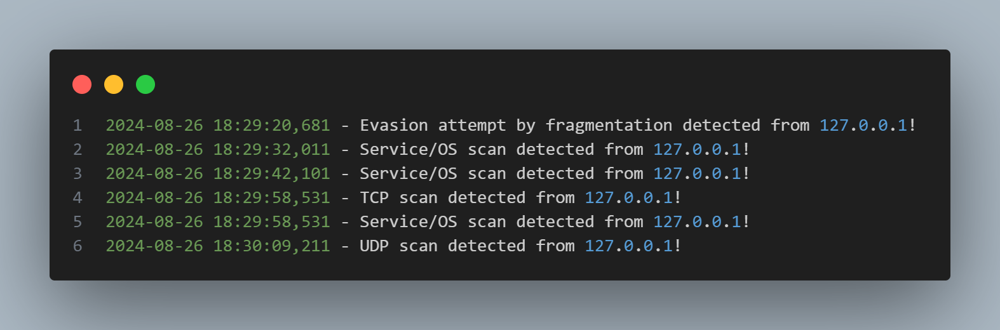

# Simple Scan Detector - Documentation
### Overview

This is a basic scan detection system developed in Python using the Scapy library. It can detect various types of scans, such as port scans, fragmentation evasion, decoy scans, UDP scans, and service/OS reconnaissance. The program logs scan events with detailed information.

> **Note**: This project is a simple example of a basic scan detection system and is meant for educational purposes.



### Detection Types

1. **TCP Port Scan**: Detects attempts to probe TCP ports.
2. **UDP Scan**: Detects attempts to probe UDP ports.
3. **Fragmentation Evasion**: Identifies fragmented packets, a technique used to avoid detection.
4. **Decoy Scan**: Detects attempts to disguise the source using fake IPs (decoys).
5. **Service/OS Reconnaissance**: Detects attempts to identify services and operating systems running on open ports.

### How to Run

1. **Clone the Repository**:
    ```bash
    git clone https://github.com/Rafael-BD/SimpleScanDetector.git
    cd SimpleScanDetector
    ```

2. **Install Dependencies**: Ensure that you have Python and Scapy installed:
    ```bash
    pip install -r requirements.txt
    ```

3. **Edit the Configuration File**: Open the config.yaml file to adjust settings according to your environment:
    - `interface`: Network interface where the sniffer will operate.
    - `time_window`: Time window in seconds to consider connection attempts.
    - `port_threshold`: Minimum number of different ports that indicate a possible scan.
    - `fragmentation_limit`: Limit of packet fragments before considering evasion.

4. **Run the Detector (as administrator)**:
    ```bash
    sudo python main.py
    ```

5. **Manual Testing with Nmap**

    TCP Port Scan:
    ```bash
    sudo nmap -sS <target IP address>
    ```

    UDP Scan:
    ```bash
    sudo nmap -sU <target IP address>
    ```

    Decoy Scan:
    ```bash
    sudo nmap -D RND:10 <target IP address>
    ```

    Fragmentation Evasion:
    ```bash
    sudo nmap -f <target IP address>
    ```

    Service/OS Reconnaissance:
    ```bash
    sudo nmap -A <target IP address>
    ```

### Logs

Logs generated by the detector are stored in the logs/ directory with the format `scan_detector_<date>_<time>.log`. Each detection event is logged with a timestamp, including the type of scan detected and the source IP.